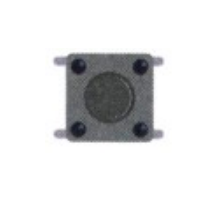
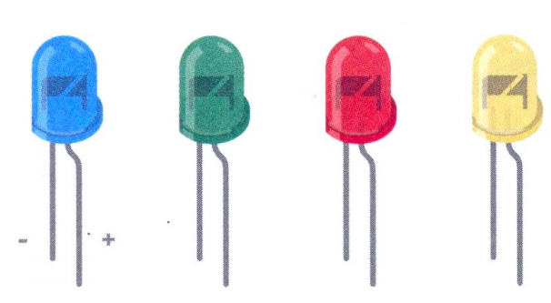

# Circuitos

## Conceptos Básicos

### Electricidad

### Voltaje

### Intensidad de corriente

### DC y AC

### Resistencia Eléctrica

### Ley de Ohm

### Potencia eléctrica

### Señales digitales y señales analógicas

## Componentes eléctricos básicos

### Protoboard

Es una placa sobre la cual se pueden montar los componentes electrónicos. Facilitando de esta forma la realización de circuitos sin la necesidad de soldar.
En las siguientes imágenes se podrá ver como se componen estas placas. Las filas verticales y horizontales de la placa conducen la electricidad a través de los conectores de metal fino que hay debajo del plástico con agujeros.

### Cables puente

Se utilizan para conectar unos componentes con otros sobre la placa de pruebas(protoboard), y la tarjeta Arduino.

### Resistores

Los resistores son componentes que se oponen al paso de la energía eléctrica. Particularmente, estos se encargan de transformar la energía eléctrica en calor. Estos no tienen polaridad, por lo que es indiferente la posición en que se colocan.
La resistencia de cada resistor va a determinar cuanta oposición va a haber al paso de la corriente. Los valores de las resistencias se indican mediante bandas de colores. Cada color se corresponde con un número, como se puede ver en la tabla inferior. 
Cada
resistencia tiene entre 4 o 5 bandas. En las resistencias con 4 bandas, las dos primeras
bandas indican los dos primeros dígitos del valor de la resistencia, mientras que la tercera
banda de color indica el número de ceros que sigue a los dos primeros valores
(técnicamente esta tercera banda representa potencias de diez). La última banda
especifica la tolerancia: en el ejemplo inferior, se puede leer un valor de resistencia de
10K, y este valor puede variar en más o menos un 5% según esta tolerancia.

### Potenciómetros

Los potenciómetros son resistores con una resistencia variable y que cuenta con tres terminales. En las terminales extremas se conecta la señal de entrada y la tierra, la terminal central se puede usar como una salida de señal.

### Push-button

Son interruptores momentáneos que únicamente permiten el paso de la corriente cuando son presionados. Son buenos para abrir o cerrar el paso a una señal.

### LEDs

Son componentes que convierten la energía eléctrica en energía luminosa. Estos tienen polaridad, esto quiere decir que solo circula corriente a través de ellos en una sola dirección. La terminal más larga es el ánodo y esta se conectara a la alimentación (+), la terminal más corta es el cátodo y esta se conectara a la masa o GND (-).
