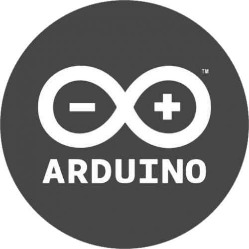

# Introducción

Arduino es la mejor forma de introducirse a la programación de microcontroladores y a la computación física.
La computación física es un acercamiento al diseño de la interacción computadora - humano que empieza considerando como los humanos se expresan de forma física.
Las interfaces comunes para la interacción con las que cuentan las computadoras se limitan a un monitor, un teclado, un mouse, entre otros elementos. Con la computación física se toma como referencia el cuerpo humano y sus capacidades para rediseñar esas interfaces. Creando nuevas que puedan responder a lo que los humanos pueden hacer físicamente. Esta está basada en el uso de microcontroladores para procesar estas interacciones.
En la actualidad los microcontroladores se encuentran en muchos de los dispositivos con los que interactuamos diariamente, ya sea un ascensor, un microondas, una computadora, etc.
Los microcontroladores son circuitos integrados programables , capaces de ejecutar órdenes grabadas en su memoria.

## Qué es Arduino?
Arduino es una plataforma de electrónica abierta para la creación de prototipos basada en software y hardware libre, flexibles y fáciles de usar. Se creó para artistas,  estudiantes, diseñadores, aficionados y cualquier interesado en crear entornos u objetos interactivos. 

Arduino está conformado por tres cosas:
* Una placa hardware libre
    *  Esta incorpora un microcontrolador reprogramable y una serie de pines para realizar conexiones.
* Un software gratuito, libre y multiplataforma
    * Es un entorno de desarrollo disponible en Linux, MacOS y Windows. Nos va a brindar muchas facilidades en lo que respecta a la programación de el microcontrolador.
* Un lenguaje de programación libre
    * El lenguaje de programación de Arduino está basado en C/C++.

Se ha mencionado que Arduino está conformado por una placa y un entorno de desarrollo de *hardware y software libre* correspondientemente.

Se llama hardware libre a los dispositivos de hardware cuyas especificaciones y diagramas esquemáticos son de acceso público, ya sea bajo algún tipo de pago o de forma gratuita.

Se le llama software a todo software que respeta la libertad de los usuarios sobre su producto adquirido y, por tanto, una vez obtenido puede ser usado, copiado, estudiado, modificado, y redistribuido libremente.

## Qué podemos hacer con Arduino?
Con Arduino se pueden realizar multitud de proyectos de rango muy variado: desde robótica hasta domótica, pasando por monitorización de sensores ambientales, sistemas de navegación, telemática, etc.

Video:
https://www.youtube.com/watch?v=0XTcJ5-0u00

## Historia de Arduino

## La placa Arduino

## Familia Arduino

## Software Arduino
