# Introducción

Arduino es la mejor forma de introducirse a la programación de microcontroladores y a la computación física.
La computación física es un acercamiento al diseño de la interacción computadora - humano que empieza considerando como los humanos se expresan de forma física.
Las interfaces comunes para la interacción con las que cuentan las computadoras se limitan a un monitor, un teclado, un mouse, entre otros elementos. Con la computación física se toma como referencia el cuerpo humano y sus capacidades para rediseñar esas interfaces. Creando nuevas que puedan responder a lo que los humanos pueden hacer físicamente. Esta está basada en el uso de microcontroladores para procesar estas interacciones.
En la actualidad los microcontroladores se encuentran en muchos de los dispositivos con los que interactuamos diariamente, ya sea un ascensor, un microondas, una computadora, etc.
Los microcontroladores son circuitos integrados programables , capaces de ejecutar órdenes grabadas en su memoria.

## Qué es Arduino?
Arduino es una plataforma de electrónica abierta para la creación de prototipos basada en software y hardware libre, flexibles y fáciles de usar. Se creó para artistas,  estudiantes, diseñadores, aficionados y cualquier interesado en crear entornos u objetos interactivos. 

Arduino está conformado por tres cosas:
* Una placa hardware libre
    *  Esta incorpora un microcontrolador reprogramable y una serie de pines para realizar conexiones.
* Un software gratuito, libre y multiplataforma
    * Es un entorno de desarrollo disponible en Linux, MacOS y Windows. Nos va a brindar muchas facilidades en lo que respecta a la programación de el microcontrolador.
* Un lenguaje de programación libre
    * El lenguaje de programación de Arduino está basado en C/C++.

Se ha mencionado que Arduino está conformado por una placa y un entorno de desarrollo de *hardware y software libre* correspondientemente.

Se llama hardware libre a los dispositivos de hardware cuyas especificaciones y diagramas esquemáticos son de acceso público, ya sea bajo algún tipo de pago o de forma gratuita.

Se le llama software a todo software que respeta la libertad de los usuarios sobre su producto adquirido y, por tanto, una vez obtenido puede ser usado, copiado, estudiado, modificado, y redistribuido libremente.

## Qué podemos hacer con Arduino?
Con Arduino se pueden realizar multitud de proyectos de rango muy variado: desde robótica hasta domótica, pasando por monitorización de sensores ambientales, sistemas de navegación, telemática, etc.

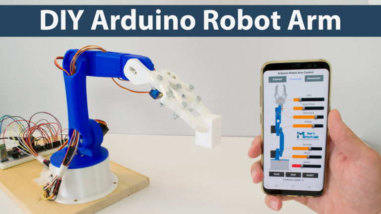
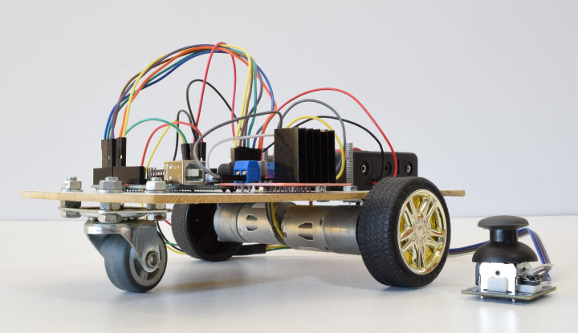
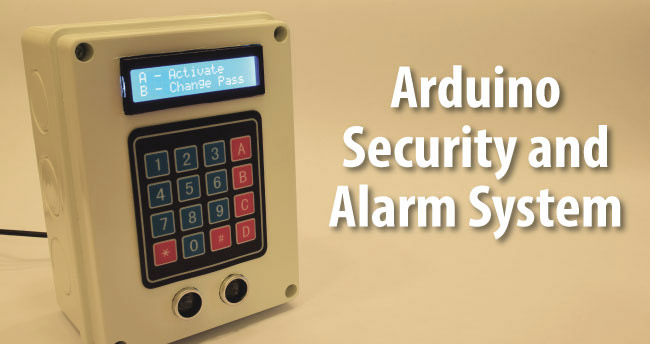
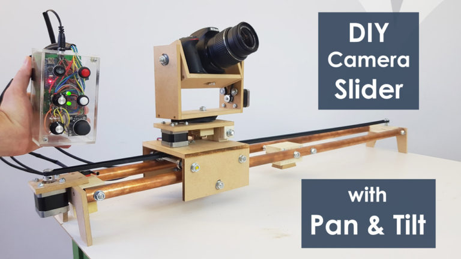

Video:
[Ejemplos de proyectos](https://www.youtube.com/watch?v=0XTcJ5-0u00)

## Historia de Arduino
Arduino nació en el año 2005 en el Instituto de Diseño Interactivo de Ivrea
(Italia). Arduino apareció por la necesidad de contar con un dispositivo para utilizar
en las aulas que fuera de bajo coste, que funcionase bajo cualquier sistema operativo
y que contase con documentación adaptada a gente que quisiera empezar de cero.
La idea original fue, pues, fabricar la placa para uso interno de la escuela. No obstante, el Instituto se vio obligado a cerrar sus puertas precisamente en
2005. Ante la perspectiva de perder en el olvido todo el desarrollo del proyecto
Arduino que se había ido llevando a cabo durante aquel tiempo, se decidió liberarlo y
abrirlo a “la comunidad” para que todo el mundo tuviera la posibilidad de participar
en la evolución del proyecto, proponer mejoras y sugerencias y mantenerlo “vivo”. Y
así ha sido: la colaboración de muchísima gente ha hecho que Arduino poco a poco
haya llegado a ser lo que es actualmente: un proyecto de hardware y software libre
de ámbito mundial. 
## La placa Arduino
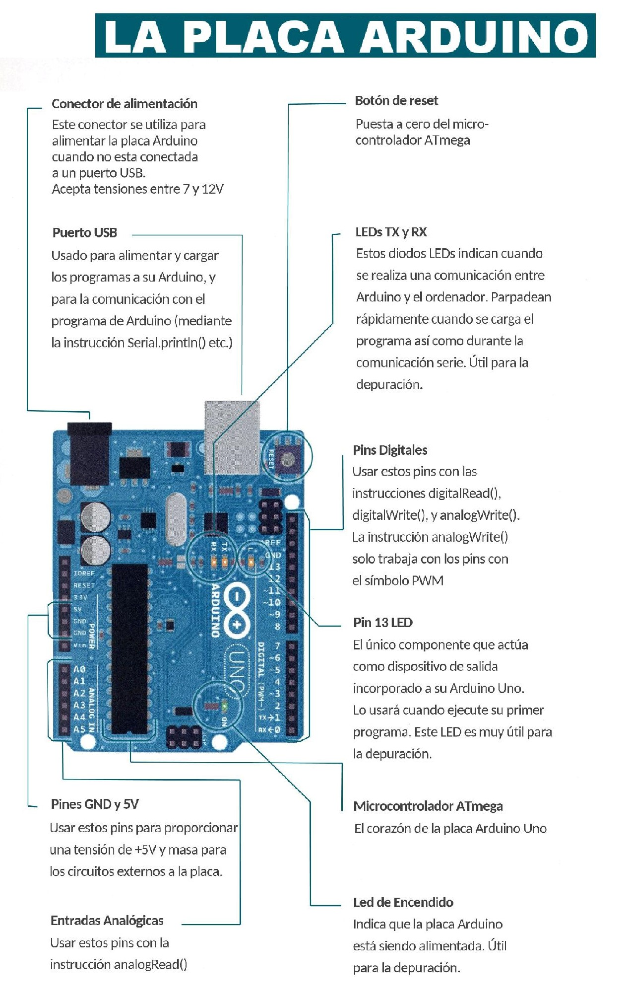
## Familia Arduino
Existen distintas variantes de la placa Arduino, cada una especializada en trabajar dentro de circunstancias específicas.

### Arduino UNO
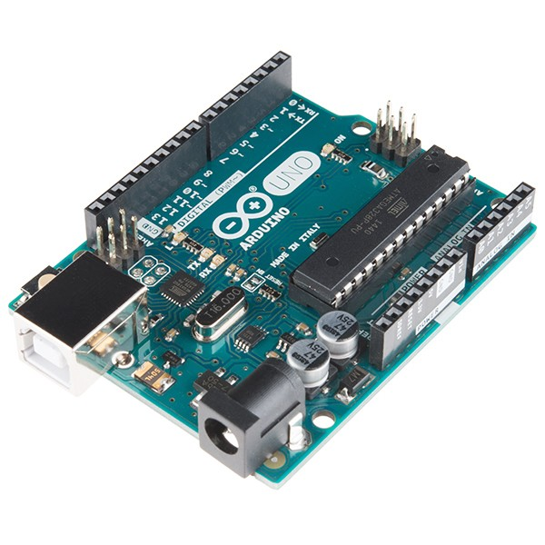

Es el modelo de referencia de la plataforma Arduino y es el más usado y documentado de las plácas disponibles.
Cuenta con 14 pines de entrada/salida digitales y 6 entradas analógicas.
### Arduino Mega 2560
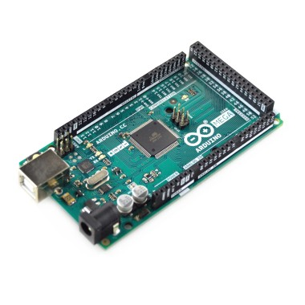

Como características más
destacables diremos que tiene 54 pines de entrada/salida digitales, 16 entradas analógicas y 4
receptores/transmisores serie TTL-UART.
### Arduino Mega ADK
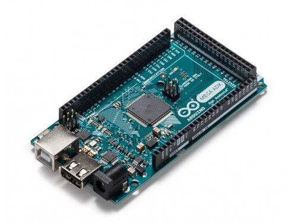

La placa ADK se puede conectar cualquier dispositivo que tenga un
puerto USB periférico (teléfonos móviles, cámaras de fotos o vídeo, teclados,
ratones, joysticks y mandos de diferentes videoconsolas, etc.)
En concreto, la placa Arduino ADK está especialmente diseñada para
interactuar con teléfonos móviles funcionando con el sistema Android. 
### Arduino Ethernet
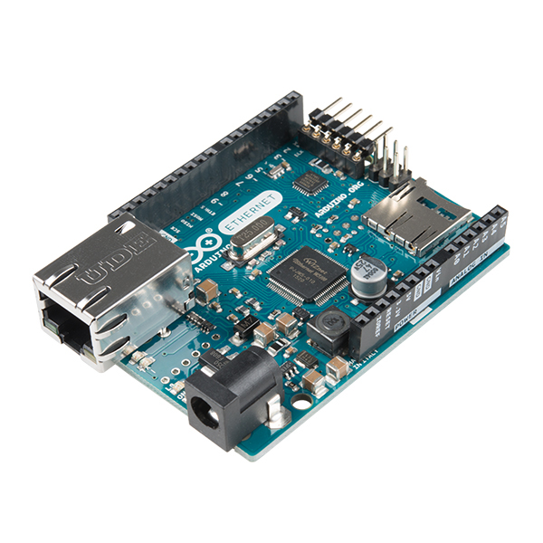

La placa Arduino Ethernet permite transferir datos entre ella misma
(los cuales pueden ser obtenidos de algún sensor, por ejemplo) y cualquier otro
dispositivo conectado a su misma red LAN
### Arduino Lilypad
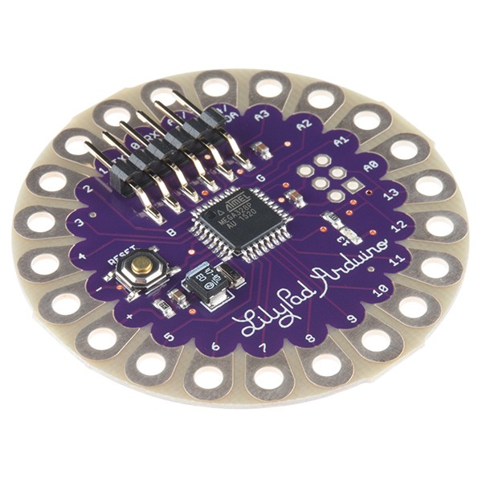

La placa Arduino LilyPad está diseñada para ser cosida a material textil.
Permite además conectarle (mediante hilos conductores) fuentes de alimentación,
sensores y actuadores de forma que se puedan “llevar encima”, haciendo posible la
creación de vestidos y ropa “inteligente”. 
### Arduino Nano
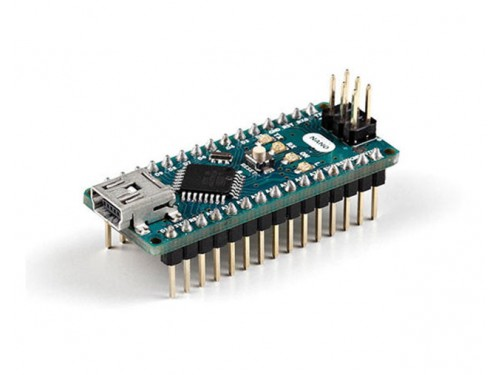

La característica más destacable de esta placa es que a pesar de su tamaño
(0,73 pulgadas de anchura por 1,70 de longitud), sigue ofreciendo el mismo número de salidas y entradas digitales y analógicas que la Arduino UNO y la misma
funcionalidad que esta.

## Software Arduino
